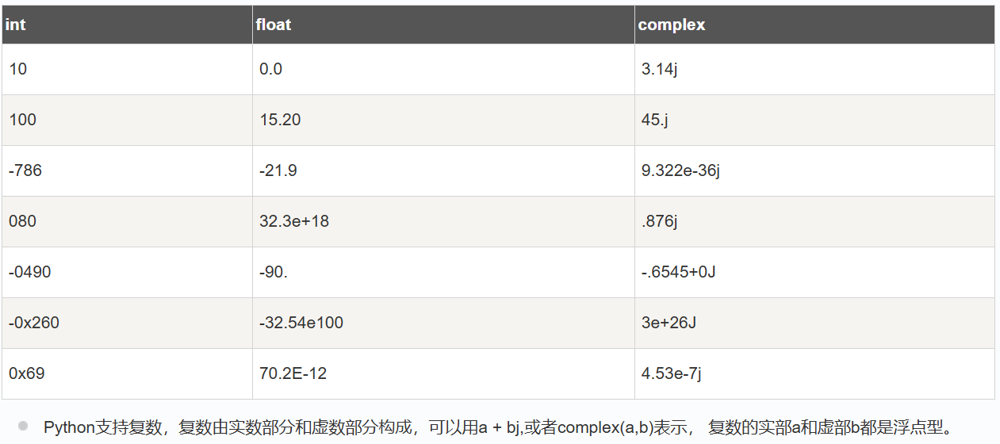
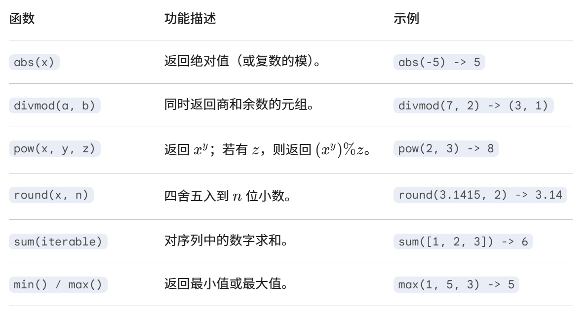

# 数字类型

---


## 一、Python 支持三种不同的数值类型：

**整型(int)**  通常被称为是整型或整数，是正或负整数，不带小数点。Python3 整型是没有限制大小的，可以当作 Long 类型使用，所以 Python3 没有 Python2 的 Long 类型。布尔(bool)是整型的子类型。

**浮点型(float)**  浮点型由整数部分与小数部分组成，浮点型也可以使用科学计数法表示（2.5e2 = 2.5 x 102 = 250）

**复数( (complex))**  复数由实数部分和虚数部分构成，可以用a + bj,或者complex(a,b)表示， 复数的实部a和虚部b都是浮点型。

### 参考表格



## 二、内置运算函数
### 参考表格



### 其他内置函数

1. **`int()`**：将数字或字符串转换为整数，如果是浮点数，会截断小数部分；可以指定进制转换字符串为整数。

   ```python
   int(3.7)   # -> 3
   int("101", 2)  # -> 5，这里表示输入了二进制
   ```

2. **`float()`**：将数字或字符串转换为浮点数。

   ```python
   float(3)   # -> 3.0
   float("3.14")  # -> 3.14
   ```

3. **`complex()`**：创建复数类型。

   ```python
   complex(1, 2)  # -> (1+2j)
   ```

4. **`bool()`**：虽然主要是逻辑判断，但也可以把数字转换成布尔值（0 -> False，非零 -> True）。

5. **`hash()`**：对数值、字符串等对象返回哈希值（整数），虽然主要用于字典和集合，但也可以理解为数值处理的一种转换。


## 注意事项
1. 如果使用e，则e的前后都必须有内容，否则报错 
2. 创建复数时，复数实部和虚部可以是0.0，虚数表示必须是j或J（大小写都可以）。 实部和虚部创建后自动转化成浮点数float
3. python中，8+'0'是错的，c中可以。我们应该写8+ord('0')
4. 


