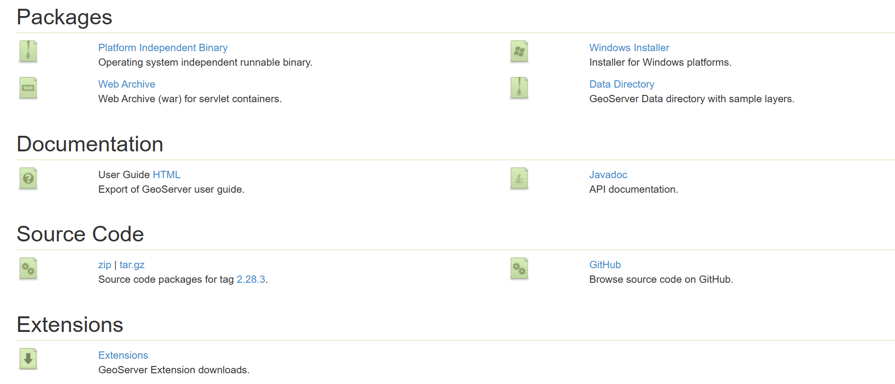

# GeoServer 
*服务器端软件，可在本地端口打开网页*  


---


## 前言

GeoServer 是一个开源的 **地理信息服务器（GIS Server）**，用于共享、处理和编辑地理空间数据。它实现了 OGC（开放地理信息联盟）的标准，如 WMS（Web Map Service）、WFS（Web Feature Service）和 WCS（Web Coverage Service），能够将各种地理数据发布为网络服务，使 GIS 数据在 Web 和客户端应用程序中可访问和可操作。  


**本机版本号：** 2.28.3  

**依赖java环境：** 老版本需要11以上，该版本推荐java17 LTS，本机亦是  


## 1️.GeoServer 概述

GeoServer 由 Open Source Geospatial Foundation (OSGeo) 社区维护，是全球使用最广泛的开源 GIS 服务器之一。它的核心特点包括：

- **开源免费**：基于 LGPL 许可证，无需购买商业许可。  
- **多数据支持**：支持矢量数据（Shapefile、PostGIS、GeoJSON、KML、GML）、栅格数据（GeoTIFF、ImageMosaic）、数据库（PostGIS、Oracle Spatial、SQL Server）等。  
- **标准化服务**：支持 WMS、WFS、WCS、WMTS 等 OGC 标准，使地理数据跨平台访问无障碍。  
- **丰富扩展插件**：通过社区插件可支持更多格式和功能，如 GeoWebCache 缓存、SLD 样式编辑、事务性 WFS。  
- **Web 管理界面**：提供易用的 Web UI 进行数据发布、服务管理和样式设计。  


## 2️.GeoServer 核心功能

### 数据发布

GeoServer 可以将各种 GIS 数据源发布为网络服务，核心服务类型包括：

- **WMS（Web Map Service）**：发布地图图像，支持多种投影和样式（SLD）。  
- **WFS（Web Feature Service）**：发布矢量要素，允许客户端进行查询和编辑。  
- **WCS（Web Coverage Service）**：发布栅格数据，支持原始数据下载。  
- **WMTS（Web Map Tile Service）**：发布切片地图，提高地图渲染速度。  

### 样式管理

GeoServer 支持 **SLD（Styled Layer Descriptor）** 样式规范，可以对地图图层进行丰富的样式设计，包括：

- 颜色、线型、符号和标注  
- 分类渲染、比例尺控制  
- 动态样式切换  

通过 Web 界面，你可以上传或编辑 SLD 文件，让地图呈现个性化效果。

### 高性能与缓存

- **GeoWebCache 集成**：GeoServer 内置瓦片缓存，提高地图响应速度。  
- **事务性 WFS-T**：支持客户端对矢量数据进行增删改操作，同时保证数据一致性。  
- **大数据支持**：可连接 PostGIS、Oracle Spatial 等数据库，支持大规模数据查询。  


## 3️.安装与配置

### 系统需求

- **操作系统**：Windows、Linux、macOS 均可  
- **Java 环境**：一般来说，Java 17 及以上  
- **Web 容器**（可选）：Tomcat、Jetty，也可使用自带 Jetty 内嵌服务器  
- **硬件建议**：内存 ≥ 4GB，磁盘空间视数据量而定  

### 安装步骤（联想拯救者y9000p，windows）

1. 安装并配置java
   GeoServer依赖 **java** 环境，根据官方文档，我下载的是**GeoServer2.28.3版本** ，推荐使用的java版本是java17 LTS：  
   [https://adoptium.net/](https://adoptium.net/)  
   <br>
   安装时勾选全部选项，这样会把其设置到系统环境，如下图所示：  
   <br>
2. 下载 GeoServer 最新稳定版（.zip 或 .exe）：  
   [https://geoserver.org/download/](https://geoserver.org/download/)    
      
    可以看到多个形式，这里我们下载 **Platform Independent Binary** ，得到一个zip包。  
    <br>
3. 解压或运行安装程序，选择安装路径。  
    我们自己建立一个文件夹如geoServer,把刚才的zip解压缩进去，由于我已经将java添加进了系统环境变量，所以无需该配置。  否则，我们需要在startup.bat的@echo off 下方插入一行`set JAVA_HOME=D:\你的位置\java`  
    <br>
4. 启动 GeoServer：

   * Windows：点击`bin\`进入运行 `startup.bat`
   * Linux/macOS：运行 `./startup.sh`  
   <br>

5. 打开浏览器访问 GeoServer Web 界面：

   ```
   http://localhost:8080/geoserver
   ```

   默认用户名和密码：`admin / geoserver`


## 4️.发布数据示例

### 4.1 发布 Shapefile

1. 在 GeoServer Web 界面登录 → Data → Stores → Add new Store → Shapefile
2. 上传或指定 Shapefile 文件路径
3. 配置坐标系（CRS）
4. 保存并发布 Layer
5. 配置样式（SLD）
6. 通过 WMS URL 访问地图，例如：

   ```
   http://localhost:8080/geoserver/wms?service=WMS&version=1.1.0&request=GetMap&layers=workspace:layername&styles=&bbox=...&width=800&height=600&srs=EPSG:4326&format=image/png
   ```

### 4.2 发布 PostGIS 数据

1. 添加数据存储 → 选择 PostGIS
2. 配置数据库连接信息（Host, Port, Database, User, Password）
3. 发布数据库表为图层
4. 配置样式并保存


## 5️.样式与地图可视化

* **SLD 文件**：XML 格式，描述图层的样式
* **Web 界面编辑器**：直接在 GeoServer 中编辑样式，无需手写 XML
* **示例 SLD 功能**：

  * 分类渲染（按属性颜色分级）
  * 标注（Label）
  * 图例（Legend）


## 6️.高级功能

### GeoWebCache 瓦片缓存

* 自动生成瓦片，提高 WMS/WMTS 服务响应速度
* 支持缓存刷新策略（时间/区域/图层）
* 可与前端 Web 地图框架（OpenLayers、Leaflet）无缝结合

### 事务性 WFS-T

* 支持客户端通过 HTTP 对矢量数据进行增、删、改操作
* 数据库同步保证事务一致性
* 适合构建协同 GIS 应用

### 扩展与插件

* 额外数据格式支持：ECW、MrSID、GML2/GML3 等
* 安全插件：LDAP 集成、HTTPS 配置
* 监控插件：记录访问日志、性能监控


## 7️.常用前端集成

GeoServer 可与多种 Web 地图库集成，构建交互式地图应用：

* **OpenLayers**

  ```javascript
  var map = new ol.Map({
    target: 'map',
    layers: [
      new ol.layer.Tile({
        source: new ol.source.TileWMS({
          url: 'http://localhost:8080/geoserver/wms',
          params: {'LAYERS': 'workspace:layername', 'TILED': true},
          serverType: 'geoserver'
        })
      })
    ],
    view: new ol.View({
      center: ol.proj.fromLonLat([116.404, 39.915]),
      zoom: 10
    })
  });
  ```

* **Leaflet**

  ```javascript
  L.tileLayer.wms('http://localhost:8080/geoserver/wms', {
      layers: 'workspace:layername',
      format: 'image/png',
      transparent: true
  }).addTo(map);
  ```

* **CesiumJS**（3D 地球可视化）

  * 可通过 WMS 或 WMTS 加载 GeoServer 图层，支持三维 GIS 展示

---

## 🔗 参考资源

* [GeoServer 官网](https://geoserver.org/)
* [GeoServer 文档](https://docs.geoserver.org/stable/en/user/)
* [OpenLayers 官网](https://openlayers.org/)
* [Leaflet 官网](https://leafletjs.com/)
* [OGC 标准](http://www.opengeospatial.org/standards)


